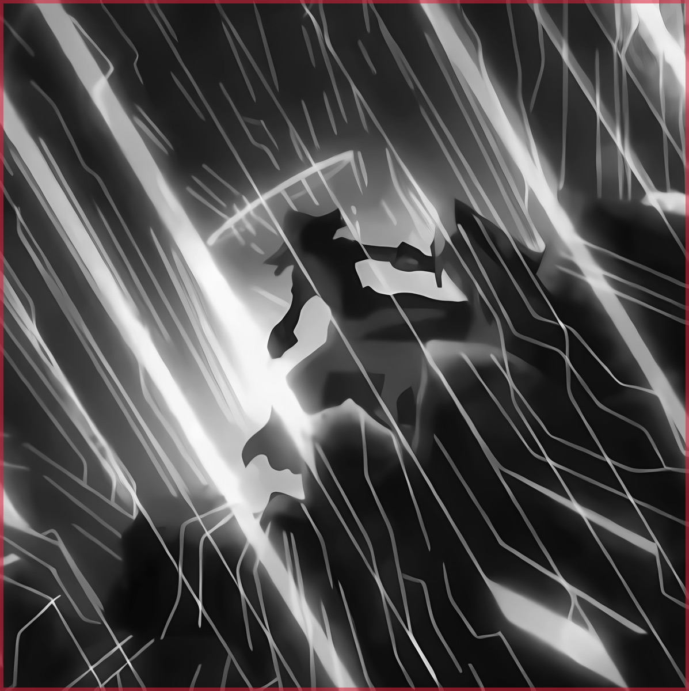

<div align="center">



# cid

**A menu bar app for the pile of anime edits you download when you need to lock in.**<br>
*Hit ⌘⇧↵ anywhere and one starts playing. Type to find a different one.*

</div>

---

You have a folder of hype edits. You are demotivated. The problem is that the edit you
need right now is a specific one — the cold, calculating one, or the one where the
weakest guy gets back up — and finding it means scrolling past forty thumbnails until
something looks right.

cid fixes that. Paste a link, and it downloads the video, reads what the uploader wrote
about it, and works out what the edit *feels* like. Then it lives in your menu bar: hit
<kbd>⌘⇧↵</kbd> from anywhere and a phone-shaped panel drops in over whatever you were
doing, already playing something. Start typing and it searches. <kbd>esc</kbd> and it's
gone again.

Named after Cid Kagenou, who spent the whole show pretending to be a background
character.

## How it decides what an edit feels like

This is the part worth explaining, because the obvious approach — tagging a thousand
edits by hand — is not one anybody actually does.

**The metadata already exists.** Edit titles are unusually descriptive: `lelouch edit |
villain arc`, `meruem - cold`, `gojo edit [phonk]`. yt-dlp hands over the title,
description, uploader and the uploader's own tags at download time, for free. That is a
pre-written description of the vibe, and throwing it away would be the actual mistake.

**That's what gets vectorized.** All of it goes into one short "vibe card" per edit,
embedded locally with a small sentence model (MiniLM, ~25MB, runs in the app, no API
key, offline after first launch). The vectors live in a JSON file next to your videos.

**The mood chips write themselves.** cid defines ten mood axes — `LOCK IN`, `GENIUS`,
`RAW POWER`, `VILLAIN ARC`, `COMEBACK`, `COLD`, `UNHINGED`, `MELANCHOLY`, `PURE HYPE`,
`SHADOW` — each described in a paragraph of plain language. Those paragraphs get
embedded too, once, and every edit is scored against all ten. No LLM call, no manual
work, no per-edit cost. An edit whose top axis doesn't clear a floor is left unplaced
and says so, rather than being stamped with three chips that mean nothing.

**Searching blends three things.** Semantic similarity finds `"i need something cold and
calculated"`. Lexical matching finds `"meruem"`, which a general sentence embedder has
never heard of. And known slang gets glossed before embedding, because MiniLM predates
it — `"lock in"` reads to a 2021 model as fastening a door, and without the gloss the
training-montage edit ranks third.

There is no vector database. At a few thousand edits, cosine similarity is an in-memory
loop that finishes in under a millisecond, and every vector has to be loaded anyway.
Postgres with pgvector would be ceremony.

### What it can't do

The model reads *words about* the edit, never the edit itself. An edit uploaded with the
title `edit` and no description is invisible to it — you'll have to name that one
yourself. Running CLIP over sampled frames would fix this, and it would also let you
search `"red eyes, rain, standing alone"` and hit visually. That is the obvious next
thing and it isn't built yet.

## Getting it running

Needs [bun](https://bun.sh), plus `yt-dlp` and `ffmpeg`:

```sh
brew install yt-dlp ffmpeg
```

Then:

```sh
make
```

That builds cid, installs it to `/Applications`, and launches it. Running `make` again
is safe. `make update` does the same to an already-running copy: quits it, removes it,
rebuilds, reinstalls, relaunches. `make dev` runs it from source with hot reload, and
`bun test` runs the tests.

First launch downloads the embedding model once (~25MB, from Hugging Face) and keeps it
in the app's cache. The inference runtime ships inside the app rather than being fetched
from a CDN, so after that first download cid needs the network only to fetch videos.

## The panel

This is how you'll actually use cid. <kbd>⌘⇧↵</kbd> from any app summons a 400×712
panel — upright, because most edits are 9:16 and this way they fill the frame instead of
sitting in a letterbox. It appears centred on whichever screen your pointer is on, over
fullscreen apps included, and starts playing immediately.

| | |
|---|---|
| <kbd>⌘⇧↵</kbd> | summon, or dismiss if it's already up |
| *any letter* | start searching — no need to click anything first |
| <kbd>↵</kbd> | with the box empty: not this one, give me another |
| <kbd>↵</kbd> | while searching: play the highlighted result |
| <kbd>↑</kbd> <kbd>↓</kbd> | move through results |
| <kbd>space</kbd> | pause (only while the box is empty, so you can still type spaces) |
| <kbd>esc</kbd> | hide it back to the menu bar |

Clicking the menu bar icon does the same as the shortcut; right-clicking it opens a menu
with the library, the add sheet, and quit. An edit that finishes rolls straight into
another, so leaving it up is a queue — one that plays your whole library before it
repeats anything (see HIT ME below; it's the same deck).

Dismissing pauses the video — an invisible window playing audio over everything else is
the one thing a panel like this must never do.

Launching cid opens the panel if you already have a library, and the library window if
you don't. Closing the library window drops cid back to the menu bar rather than
quitting; the dock icon follows that window, so it's there while you're managing the
library and gone the rest of the time.

## The library window

Hit <kbd>⌘N</kbd> and paste a link. cid downloads the video into your library, pulls a
poster frame, and reads it. You can also drop video files anywhere on the window, or
point it at ones you already downloaded — those get indexed on filename alone, so name
them well.

Then, from the main screen:

| | |
|---|---|
| <kbd>/</kbd> | jump to the search box |
| <kbd>space</kbd> | **HIT ME** — one edit, picked for you |
| <kbd>enter</kbd> | HIT ME, from inside the search box |
| <kbd>⌘N</kbd> | add an edit |
| <kbd>esc</kbd> | clear the search and every filter |

HIT ME deals like a deck, not a die: it works through every edit once before it repeats
any of them, so nothing sits unwatched while the same few keep coming round. Starred
edits and ones you just added are dealt earlier in each pass, and the last few you
watched are held back, so a new pass never opens on the edit the last one ended with.
Anything you pick by hand counts as dealt. The panel and HIT ME draw from the same deck,
and it survives quitting.

It respects whatever is filtered, so chip `VILLAIN ARC`, hit space, and you get a villain
edit. Working through a filtered deck leaves your place in the full one alone.

In the player: <kbd>n</kbd> and <kbd>p</kbd> step through the current results,
<kbd>s</kbd> stars, <kbd>esc</kbd> closes. Arrow keys stay with the video for seeking.
An edit that ends rolls into the next one, so a filtered set plays as a queue.

## Where your stuff lives

```
~/cid/
  media/         the actual video files
  thumbs/        poster frames
  library.json   the index — titles, tags, moods, play counts, where the shuffle is up to
  vectors.json   one embedding per edit
```

Plain files in a plain folder. Back it up, move it, open it in Finder, delete things
from it. Nothing is hidden in an app container, and the index can be rebuilt from the
videos if it's ever lost.

## Configuration

All optional, all environment variables:

| | |
|---|---|
| `CID_LIBRARY` | put the library somewhere other than `~/cid` |
| `CID_COOKIES_FROM_BROWSER` | `chrome`, `firefox`, `safari`, `brave`… — lends yt-dlp your session for age-gated or login-walled videos |
| `CID_YTDLP_ARGS` | extra flags passed straight to yt-dlp |

If another app already owns <kbd>⌘⇧↵</kbd>, cid says so in the menu bar menu rather than
failing quietly; the icon still works.

YouTube periodically starts refusing whichever internal player client yt-dlp picked,
usually as a 403 partway through a download. cid tries several in turn and reuses
whichever works, so this mostly resolves itself. When it doesn't,
`CID_COOKIES_FROM_BROWSER` is the answer.

## Tuning the moods

The ten axes are in `src/shared/moods.ts`, and they are just prose — rewrite a blurb,
add an axis, delete one you never use. The blurbs are written as piles of natural
phrasing rather than keyword lists on purpose; that is what makes them land near real
edit titles.

After editing them, bump `LIBRARY_EMBED_VERSION` in the same file. cid notices the
mismatch on next launch, drops the stored vectors, and re-reads your whole library
against the new axes.

Slang glosses live in `src/shared/slang.ts` and work the same way — add an entry when
you catch yourself searching for something the model clearly didn't understand.

## Layout

```
src/
  main/        Electron main — windows and tray, library store, yt-dlp/ffmpeg
               ingest, the cid:// protocol
  preload/     the IPC surface exposed to the renderer
  renderer/    React UI, embedding, search ranking
  shared/      types, mood axes, slang, the vibe-card builder, the shuffle
test/          bun tests
```

Both windows run the same bundle and pick their face off the URL hash, and both drive
their own copy of `useLibrary` — the library, its vectors, and a ranked result set. That
means two copies of a 25MB model in memory, in exchange for a panel that neither knows
nor cares whether the library window is open. The one thing they share is the shuffle:
main deals every pick, so both windows work through a single deck.

The renderer is served over a custom `cid://` scheme rather than `file://`. That is not
decoration: onnxruntime boots by wrapping its wasm glue in a Blob and `import()`ing the
blob URL, and a `file://` page has an opaque origin that cannot import modules. The same
scheme serves media, with real HTTP Range support so you can actually seek.
